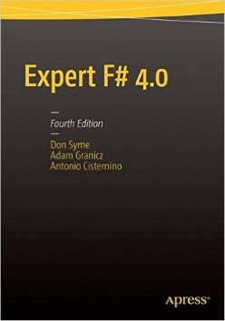

- title : Web Development With F#
- description : Web Development With F#. Denver Dev Day (October 28, 2016)
- author : Grigoriy Belenkiy (@grishace)
- theme : simple
- transition : zoom

***
- data-background : images/sponsors.png
- data-background-transition : none

' Sponsors slide (required by organizators)

***

### Web Development With F#


<!-- Image from https://theforbiddenknowledgeofenoch.blogspot.com/2014/01/who-are-followers-of-esoteric.html -->

<small>Grigoriy Belenkiy<br/>
Software engineer, S&amp;P Global<br/>
[@grishace](https://twitter.com/grishace)<br/>
<br/>
//denver/dev/day<br/>
October 28, 2016</small>

***

### Agenda

* F#
* ASP.NET WebAPI/MVC
* Suave/Freya
* WebSharper/Fable

***

### Why F#?

* Functional
* Object-oriented

' Multi-paradigm

---

### Functional

```fsharp
type WebServer = HttpRequest -> Async<HttpResponse option>
```

' SOLID  and all design patterns replaced with function composition
' example - the essence of a web-server

---

### Object-oriented

```fsharp
type Startup (env:IHostingEnvironment)=

  // This method gets called by the runtime. Use this method to configure 
  // the HTTP request pipeline.
  member this.Configure(app:IApplicationBuilder, env:IHostingEnvironment,
    loggerFactory: ILoggerFactory) =

    loggerFactory
      .AddConsole(configuration.GetSection("Logging"))
      .AddDebug()
      |> ignore

      app.UseMvc() |> ignore
```

' .NET language - need to coexist and interop with other languages
' Can use all (almost?) libraries/packages created for C#
' example - from generated ASP.NET Core MVC application

***

### F#zzBuzz


' https://en.wikipedia.org/wiki/Fizz_buzz#Programming_interviews

***
### Books

<table class="no-borders-table"><tr valign="top">
<td width="33%"><a href="http://shop.oreilly.com/product/0636920026099.do" title="Building Web, Cloud, and Mobile Solutions with F#"></a></td>
<td width="33%"><a href="https://www.amazon.com/Expert-F-4-0-Don-Syme/dp/1484207416/" title="Expert F# 4.0"></a></td>
<td width="33%"><a href="http://products.tamizhvendan.in/fsharp-applied/" title="F# Applied"></a></td>
</tr>
<tr><td>
<small><h3>Building Web, Cloud, and Mobile Solutions with F#</h3>
<h4>by Daniel Mohl</h4></small></td>

<td>
<small><h3>Expert F# 4.0</h3>
<h4>by Don Syme, Adam Granicz, Antonio Cisternino</h4></small></td>

<td>
<small><h3>F# Applied</h3>
<h4>by Tamizhvendan S</h4></small></td>
</tr></table>

***

[](https://github.com/grishace/ddd-web-fsharp)<br/>
[https://github.com/grishace/ddd-web-fsharp](https://github.com/grishace/ddd-web-fsharp)
